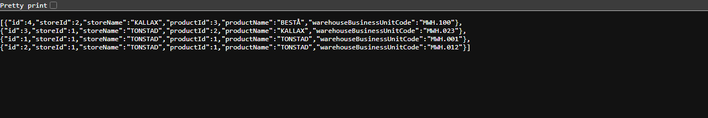

# Fulfilment & Cost Control — code assignment

This repository contains my solution for the assignment: a Quarkus service that manages warehouse
units, the stores they serve and the products they fulfil.

| What                                                     | Where                                                                   |
| -------------------------------------------------------- | ----------------------------------------------------------------------- |
| The application, how to run it, the architecture and screenshots | [java-assignment/README.md](java-assignment/README.md)          |
| The tasks being solved                                   | [java-assignment/CODE_ASSIGNMENT.md](java-assignment/CODE_ASSIGNMENT.md) |
| Answers to the three code base questions                 | [java-assignment/QUESTIONS.md](java-assignment/QUESTIONS.md)            |
| Answers to the case study scenarios                      | [case-study/CASE_STUDY.md](case-study/CASE_STUDY.md)                    |
| Domain overview                                          | [case-study/BRIEFING.md](case-study/BRIEFING.md)                        |
| Test coverage report (94.6% lines, gate at 80%)          | [docs/coverage/COVERAGE.md](docs/coverage/COVERAGE.md)                  |
| Screenshots of the running application                   | [docs/screenshots](docs/screenshots)                                    |
| CI pipeline (tests + coverage gate)                      | [.github/workflows/ci.yml](.github/workflows/ci.yml)                    |

## Quick start

```sh
cd java-assignment
./mvnw verify                                         # build, test, enforce the coverage threshold
./mvnw quarkus:dev -Plocal-h2 -Dquarkus.profile=local # run it without Docker, on an in-memory database
```

Then open <http://localhost:8080/index.html>. Plain `./mvnw quarkus:dev` runs against a PostgreSQL
dev service instead and needs Docker; the test suite never does.



## What is in the solution

- **Location, Store and Warehouse** — the three required tasks: location resolution, a legacy
  synchronisation that only fires after the database transaction commits, and the full warehouse
  lifecycle (create, retrieve, replace, archive) with every validation the assignment lists.
- **Fulfilment (bonus)** — associating warehouses as fulfilment units of products for stores, with
  the three colocation constraints.
- **Ports and adapters** in both domains, with the business rules isolated in dedicated `validation`
  packages and the cross-transaction effects published as events.
- **83 tests** — unit tests for every rule, endpoint tests over real HTTP for every API, and a
  coverage gate that fails the build under 80%.

## About the code base

Some of this code here is based on https://github.com/quarkusio/quarkus-quickstarts
