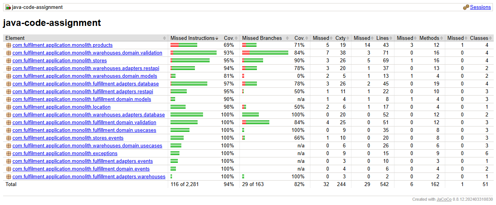

# Test coverage

Snapshot of the coverage produced by `./mvnw verify` in `java-assignment`, kept in the repository so
the number can be tracked over time without running the build. The machine readable source of this
table is [`jacoco.csv`](jacoco.csv), exported from the same run.

| | |
| --- | --- |
| Date | 2026-09-21 |
| Command | `./mvnw verify` (JDK 21, H2 in-memory database) |
| Tests | 83, all passing |
| Required minimum | 80% instructions **and** 80% lines (`jacoco:check`, fails the build) |
| **Measured** | **94.9% instructions, 94.6% lines (513/542), 82.2% branches** |



## Per package

| Package | Instructions | Branches | Lines |
| --- | ---: | ---: | ---: |
| `exceptions` | 100% | n/a | 100% (15/15) |
| `fulfillment.adapters.database` | 98% | 79% | 96% (43/45) |
| `fulfillment.adapters.events` | 100% | n/a | 100% (10/10) |
| `fulfillment.adapters.restapi` | 95% | 50% | 95% (21/22) |
| `fulfillment.adapters.warehouses` | 100% | 100% | 100% (2/2) |
| `fulfillment.domain.events` | 100% | n/a | 100% (6/6) |
| `fulfillment.domain.models` | 91% | n/a | 88% (7/8) |
| `fulfillment.domain.usecases` | 100% | 100% | 100% (35/35) |
| `fulfillment.domain.validation` | 100% | 85% | 100% (51/51) |
| `location` | 98% | 50% | 94% (16/17) |
| `products` | 70% | 71% | 67% (29/43) |
| `stores` | 96% | 90% | 93% (64/69) |
| `stores.events` | 100% | 67% | 100% (20/20) |
| `warehouses.adapters.database` | 100% | 100% | 100% (52/52) |
| `warehouses.adapters.restapi` | 95% | 79% | 97% (36/37) |
| `warehouses.domain.models` | 81% | 0% | 92% (12/13) |
| `warehouses.domain.usecases` | 100% | n/a | 100% (26/26) |
| `warehouses.domain.validation` | 94% | 84% | 96% (68/71) |
| **Total** | **94.9%** | **82.2%** | **94.6% (513/542)** |

The percentages per package are rounded; JaCoCo's own HTML report truncates instead, which is why
it prints 94% for the same 94.9%.

Every package that carries a business rule - the warehouse and fulfilment domains - is at or near
100%. The two lower numbers are deliberate:

- **`products` (67%)** is the CRUD resource that came with the original code base and was not part of
  the assignment. `ProductResource.ErrorMapper` and `StoreResource.ErrorMapper` are two identical
  `ExceptionMapper<Exception>` providers, so JAX-RS only ever selects one of them and the other
  cannot be covered by any test - which of the two is picked is not fixed, so the uncovered lines
  move between the `products` and `stores` packages from run to run.
- **`warehouses.domain.models` branch coverage (0%)** is `Warehouse.isArchived()`, a one line
  accessor that no production code path calls today: the active units are already filtered by the
  persistence adapter.

## How the numbers are produced

- Coverage data is recorded by the **`quarkus-jacoco`** extension: the standard JaCoCo agent does not
  see the classes loaded by the Quarkus test class loader, so the plain agent would under-report
  everything exercised by `@QuarkusTest`.
- The report and the threshold are handled by **`jacoco-maven-plugin`** during `verify`, from
  `target/jacoco-quarkus.exec`. The full HTML report is written to
  `java-assignment/target/site/jacoco/index.html`.
- The **generated API layer** (`com/warehouse/api/**`, produced from the OpenAPI specification at
  build time) is excluded from both the report and the threshold.
- The figures are **understated**: coverage produced by the plain JUnit unit tests, which run outside
  the Quarkus class loader, is not recorded by the extension.

## Tracking it over time

- `./mvnw verify` fails when instructions or lines drop below 80%, so a regression breaks the build
  rather than being noticed later.
- CI runs the same command on every push and pull request, prints the instruction, branch and line
  percentages in the job summary, and uploads the full HTML report as a build artifact
  (see [`.github/workflows/ci.yml`](../../.github/workflows/ci.yml)).
- To refresh this snapshot after a change:

  ```sh
  cd java-assignment
  ./mvnw verify
  cp target/site/jacoco/jacoco.csv ../docs/coverage/jacoco.csv
  ```

  and update the table above from that file.
