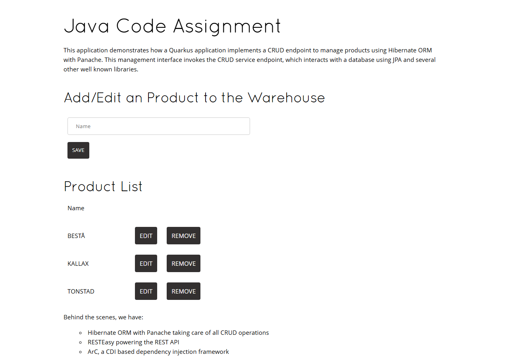
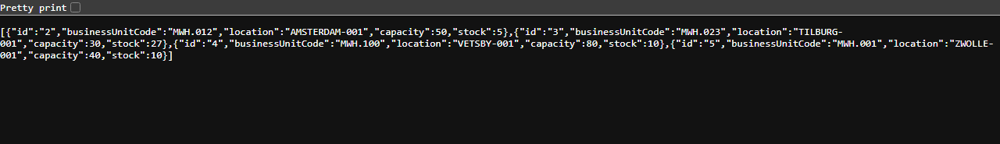
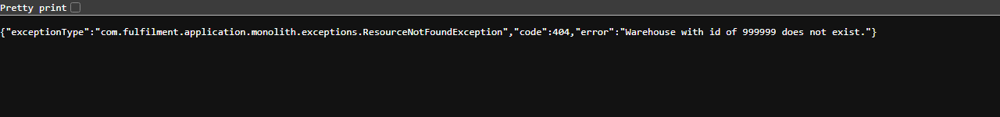

# Java Code Assignment — Warehouse colocation management

A Quarkus service that manages warehouse units, the stores they serve and the products they fulfil.
The tasks being solved are described in [CODE_ASSIGNMENT.md](CODE_ASSIGNMENT.md), the domain in
[BRIEFING.md](BRIEFING.md), and the written answers are in [QUESTIONS.md](QUESTIONS.md).

| | |
| --- | --- |
| Build | `./mvnw verify` — 83 tests, coverage gate at 80% |
| Coverage | **94.9% instructions, 94.6% lines** ([report](../docs/coverage/COVERAGE.md)) |
| Runtime | Quarkus 3.13, JDK 17 or 21, PostgreSQL (H2 and MySQL profiles included) |
| API | `/warehouse` (generated from OpenAPI), `/fulfillment`, `/store`, `/product` |

---

## Contents

1. [Quick start](#quick-start)
2. [Screenshots](#screenshots)
3. [What was implemented](#what-was-implemented)
4. [Architecture](#architecture)
5. [API reference](#api-reference)
6. [Tests and coverage](#tests-and-coverage)
7. [Running the application](#running-the-application)
8. [Design decisions and assumptions](#design-decisions-and-assumptions)
9. [CI](#ci)
10. [Troubleshooting](#troubleshooting)

---

## Quick start

```sh
./mvnw verify                                        # build, test, enforce the coverage threshold
./mvnw quarkus:dev -Plocal-h2 -Dquarkus.profile=local # run it, no Docker needed
```

Then open <http://localhost:8080/index.html> and try the API:

```sh
curl -X POST http://localhost:8080/warehouse -H 'Content-Type: application/json' \
  -d '{"businessUnitCode":"MWH.100","location":"VETSBY-001","capacity":80,"stock":10}'

curl -X POST http://localhost:8080/fulfillment -H 'Content-Type: application/json' \
  -d '{"storeId":1,"productId":1,"warehouseBusinessUnitCode":"MWH.001"}'
```

Requirements: **JDK 17 or newer** with `JAVA_HOME` set. Docker is **optional** — it is only needed to
run against the PostgreSQL dev service; the test suite and the `local-h2` profile use an in-memory
database.

---

## Screenshots

The application running from the packaged jar on the in-memory database
(`java -Dquarkus.profile=local -jar target/quarkus-app/quarkus-run.jar`).

**The bundled web UI at `/index.html`** — products served by the `/product` endpoints:



**`GET /warehouse`** — the active units, after `MWH.100` was created and `MWH.001` was replaced
(the replacement kept the business unit code and got a new technical id, while the archived row stays
in the database as history):



**`GET /fulfillment`** — the bonus feature: which warehouse fulfils which product for which store:


**Error handling** — domain exceptions are mapped to meaningful status codes and a readable payload:



**Coverage report** (`target/site/jacoco/index.html` after `./mvnw verify`):


---

## What was implemented

**1. Location** — `LocationGateway.resolveByIdentifier` resolves a location by its identifier,
ignoring case and surrounding spaces, and returns `null` when it is unknown so that the caller can
produce a meaningful error.

**2. Store** — the legacy system is no longer called inline. `StoreResource` publishes a
`StoreSyncEvent` and `LegacyStoreSynchronizer` observes it during `TransactionPhase.AFTER_SUCCESS`,
so the downstream system is only notified with data that is effectively committed, and a rolled back
transaction never reaches it. The event carries a detached copy of the store, because the observer
runs after the persistence context is closed, and a failure of the legacy system is logged instead of
failing a request whose data is already committed.

**3. Warehouse** — creation, retrieval, replacement and archiving, with the validations required by
the assignment: the business unit code must be free, the location must exist, the location must not
have reached its maximum number of warehouses, and the capacity must fit in the remaining capacity of
the location and accommodate the informed stock. A replacement additionally requires that the new
capacity accommodates the stock of the warehouse being replaced and that both stocks match.

`ReplaceWarehouseUseCase` archives the previous unit and then delegates to `CreateWarehouseUseCase`,
in a single transaction. Archiving first releases the business unit code and the location capacity, so
the new unit is validated against the state the company will actually operate in; if the creation
fails, the whole replacement is rolled back.

Warehouses are never physically deleted: archiving sets `archivedAt` and the row is kept, which is
what preserves the history of the business unit (and the cost history discussed in the case study).
The active warehouses are the ones returned by the API.

**Bonus — fulfilment** — `Fulfillment` associates a warehouse, a product and a store, enforcing the
three constraints: at most 2 warehouses per product in a store, at most 3 warehouses per store, and
at most 5 product types per warehouse.

---

## Architecture

Both modules that carry business rules — warehouses and fulfilment — follow the same **ports and
adapters** layout. The domain holds the model, the rules and the interfaces; nothing inside it
imports JAX-RS, Panache or another module's classes.

```
com.fulfilment.application.monolith
├── warehouses
│   ├── domain
│   │   ├── models          Warehouse, Location                       (plain objects)
│   │   ├── ports           WarehouseStore, LocationResolver,         (interfaces)
│   │   │                   Create/Replace/ArchiveWarehouseOperation
│   │   ├── validation      WarehousePayloadValidator,                (the rules)
│   │   │                   WarehouseCreation/Replacement/ArchiveValidator
│   │   └── usecases        Create/Replace/ArchiveWarehouseUseCase    (orchestration)
│   └── adapters
│       ├── database        DbWarehouse, WarehouseRepository          (implements WarehouseStore)
│       └── restapi         WarehouseResourceImpl                     (implements the generated API)
│
├── fulfillment
│   ├── domain
│   │   ├── models          Fulfillment, StoreReference, ProductReference
│   │   ├── ports           FulfillmentStore, StoreResolver, ProductResolver, WarehouseResolver,
│   │   │                   Associate/Remove/RetrieveFulfillmentOperation
│   │   ├── validation      FulfillmentRequestValidator, FulfillmentReferenceValidator,
│   │   │                   FulfillmentConstraintValidator
│   │   ├── usecases        Associate/Remove/RetrieveFulfillmentUseCase
│   │   └── events          FulfillmentChangedEvent
│   └── adapters
│       ├── database        DbFulfillment, FulfillmentRepository,
│       │                   StoreReferenceGateway, ProductReferenceGateway
│       ├── warehouses      ActiveWarehouseGateway                    (bridges to the warehouse port)
│       ├── restapi         FulfillmentResource, FulfillmentRequest/Response
│       └── events          FulfillmentAuditLogger                    (observes AFTER_SUCCESS)
│
├── stores                  Store, StoreResource, LegacyStoreManagerGateway
│   └── events              StoreSyncEvent, LegacyStoreSynchronizer   (observes AFTER_SUCCESS)
├── products                Product, ProductRepository, ProductResource
├── location                LocationGateway                           (implements LocationResolver)
└── exceptions              ValidationException, ResourceNotFoundException, ExceptionMappers
```

A request flows in one direction only:

```
HTTP  →  restapi adapter  →  driving port  →  use case  →  validators  →  driven port  →  database adapter
                                                   │
                                                   └──  domain event  →  observer, after the commit
```

Three consequences worth calling out:

- **Validation is a layer of its own.** The limits and the messages live in the `validation`
  packages; the use cases only orchestrate. `FulfillmentConstraintValidator` is where the three bonus
  constraints are written down, and `WarehouseCreationValidator` is where the location rules are, so
  a rule can be read and unit tested without a database, an HTTP call or a Quarkus boot.
- **Fulfilment does not depend on the warehouse, store or product classes.** It declares what it
  needs as ports (`WarehouseResolver`, `StoreResolver`, `ProductResolver`) and the adapters connect
  them, so the fulfilment rules can be tested against three mocks.
- **What leaves the transaction is an event.** Both the store synchronisation and the fulfilment
  audit trail observe `TransactionPhase.AFTER_SUCCESS`, which is the only way to guarantee that a
  downstream system never sees data that was rolled back.

---

## API reference

### Warehouse — generated from `src/main/resources/openapi/warehouse-openapi.yaml`

| Method   | Path                                        | Description                                        |
| -------- | ------------------------------------------- | -------------------------------------------------- |
| `GET`    | `/warehouse`                                | List the active warehouses                         |
| `POST`   | `/warehouse`                                | Create a warehouse (`201`)                         |
| `GET`    | `/warehouse/{id}`                           | Get an active warehouse by its technical id        |
| `DELETE` | `/warehouse/{id}`                           | Archive a warehouse (`204`)                        |
| `POST`   | `/warehouse/{businessUnitCode}/replacement` | Replace the active warehouse of that business unit |

### Fulfillment (bonus) — associating warehouses as fulfilment units

| Method   | Path                                        | Description                                  |
| -------- | ------------------------------------------- | -------------------------------------------- |
| `GET`    | `/fulfillment`                              | List all the associations                    |
| `GET`    | `/fulfillment/store/{storeId}`              | List the associations of a store             |
| `GET`    | `/fulfillment/warehouse/{businessUnitCode}` | List the associations of a warehouse         |
| `POST`   | `/fulfillment`                              | Associate a warehouse/product/store (`201`)  |
| `DELETE` | `/fulfillment/{id}`                         | Remove an association (`204`)                |

`Store` and `Product` keep their original CRUD endpoints under `/store` and `/product`.

### Status codes

| Code  | When                                                                                  |
| ----- | ------------------------------------------------------------------------------------- |
| `400` | A business rule was broken — unknown location, capacity exceeded, constraint reached   |
| `404` | The store, product, warehouse or association does not exist (or is archived)          |
| `422` | Store payload rejected by the original `StoreResource` validation                     |

Errors are returned as `{"exceptionType": "...", "code": 400, "error": "..."}`.

---

## Tests and coverage

| Test                                | What it covers                                                     |
| ----------------------------------- | ------------------------------------------------------------------ |
| `*WarehouseUseCaseTest`             | The warehouse rules, in isolation, with mocked ports               |
| `AssociateFulfillmentUseCaseTest`   | The association flow, including what is *not* stored or published  |
| `RemoveFulfillmentUseCaseTest`      | Removal and its event                                              |
| `RetrieveFulfillmentUseCaseTest`    | Reads, and unknown store or warehouse reported instead of an empty list |
| `FulfillmentConstraintValidatorTest`| The three colocation constraints, including what must *not* count twice |
| `LocationGatewayTest`               | Location resolution, including unknown and blank identifiers       |
| `WarehouseRepositoryTest`           | Persistence adapter, including archiving as a soft delete          |
| `WarehouseEndpointTest`             | The warehouse API: happy paths and every rejection, over real HTTP |
| `StoreEndpointTest`                 | Store CRUD and the transactional guarantee of the legacy sync      |
| `ProductEndpointTest`               | Product CRUD and its error responses                               |
| `FulfillmentEndpointTest`           | The bonus feature end to end and its three constraints             |

```sh
./mvnw verify   # 83 tests + coverage gate; HTML report in target/site/jacoco/index.html
./mvnw test     # tests only, without the coverage gate
```

Coverage is collected by the `quarkus-jacoco` extension (the standard agent does not see the classes
loaded by the Quarkus test class loader) and reported and enforced by `jacoco-maven-plugin`; the
generated API package is excluded. **Current coverage is 94.6% of lines and 94.9% of instructions,
against a required minimum of 80%** — and it is understated, since coverage produced by the plain unit tests is not recorded by the
extension. A per package breakdown, kept in the repository so it can be tracked between runs, is in
[`docs/coverage/COVERAGE.md`](../docs/coverage/COVERAGE.md).

The suite needs **no Docker daemon**: it runs on H2, and no test depends on another's data or on the
execution order.

`WarehouseEndpointIT` is a `@QuarkusIntegrationTest` that runs against the packaged application and
therefore needs a running PostgreSQL. It is not part of the default build (the failsafe plugin is only
configured in the `native` profile, as in the original project); the same scenarios are covered by
`WarehouseEndpointTest` during `./mvnw verify`.

---

## Running the application

Dev mode (Quarkus Dev Services starts a PostgreSQL container automatically, so Docker must be
running):

```sh
./mvnw quarkus:dev
```

Dev mode **without Docker**, on an in-memory database — same live reload, nothing to install. This is
also the command to use as a Maven run configuration in IntelliJ:

```sh
./mvnw quarkus:dev -Plocal-h2 -Dquarkus.profile=local
```

As a packaged application on the same in-memory database (data resets on restart):

```sh
./mvnw package -Plocal-h2 -DskipTests -Dquarkus.profile=local
java -Dquarkus.profile=local -jar target/quarkus-app/quarkus-run.jar
```

> The profile has to be passed to `package` as well as to `java`: the database kind is resolved at
> build time, so a jar packaged without it still expects PostgreSQL.

Against a local **MySQL** — useful to inspect the data with MySQL Workbench, since the rows survive a
restart. Create the schema once, then run with the `local-mysql` profile:

```sql
CREATE DATABASE IF NOT EXISTS fulfilment;
CREATE USER IF NOT EXISTS 'quarkus_test'@'localhost' IDENTIFIED BY 'quarkus_test';
GRANT ALL PRIVILEGES ON fulfilment.* TO 'quarkus_test'@'localhost';
```

```sh
./mvnw quarkus:dev -Plocal-mysql -Dquarkus.profile=mysql
```

Host, port, database and credentials can be overridden with the `MYSQL_HOST`, `MYSQL_PORT`,
`MYSQL_DB`, `MYSQL_USER` and `MYSQL_PASSWORD` environment variables. MySQL has no sequences, so this
profile seeds from `import-mysql.sql`, which resets Hibernate's sequence emulation tables with an
`UPDATE` rather than the `ALTER SEQUENCE` used by PostgreSQL and H2.

As a packaged application against a local **PostgreSQL**:

```sh
docker run -it --rm=true --name quarkus_test \
  -e POSTGRES_USER=quarkus_test -e POSTGRES_PASSWORD=quarkus_test -e POSTGRES_DB=quarkus_test \
  -p 15432:5432 postgres:13.3

./mvnw package
java -jar ./target/quarkus-app/quarkus-run.jar
```

If your PostgreSQL listens on the standard port instead of `15432`, override the URL at startup rather
than editing the file:

```sh
java -Dquarkus.datasource.jdbc.url=jdbc:postgresql://localhost:5432/quarkus_test \
  -jar target/quarkus-app/quarkus-run.jar
```

The connection properties are in `src/main/resources/application.properties` and the schema is
recreated and seeded from `src/main/resources/import.sql` at every start. The `local-h2` Maven profile
only raises the H2 driver from test to compile scope; it is not part of the default build, so it
changes nothing for the normal PostgreSQL setup or for CI.

---

## Design decisions and assumptions

- **The warehouse is referenced by its business unit code in the fulfilment associations**, not by
  row id. A replacement archives the row but keeps the business unit code, and the new unit is
  expected to take over the fulfilment duties of the one it replaced.
- **`{id}` in the warehouse API is the technical id**, as in the OpenAPI specification and in the
  provided integration test, while the replacement endpoint is addressed by business unit code.
- **A replacement may target a different location.** The briefing describes replacements in the same
  area, but the constraint is not listed among the required validations, so instead of forbidding it
  the new location is fully validated (existence, number of warehouses and capacity).
- **Validation lives in its own layer**, not in the use cases and not in the resources, so that a rule
  is stated once and can be unit tested without infrastructure. Existence checks are validators too
  (`FulfillmentReferenceValidator`), which is what keeps the `404` messages identical between the
  association and the read endpoints.
- **Errors** are raised as domain exceptions (`ValidationException`, `ResourceNotFoundException`) and
  translated to `400` and `404` by `ExceptionMappers`, keeping JAX-RS types out of the domain.
- **`WarehouseCreationStatusFilter`** restores the `201` documented in the specification: the
  generated interface returns `Warehouse` instead of `Response`, so the status cannot be set by the
  handler itself.
- **`FulfillmentAuditLogger` is deliberately small.** It records the committed associations, and is
  the seam where a downstream system would be notified with the same after-commit guarantee as the
  store synchronisation, without inventing an integration the assignment does not ask for.
- **Tests run on H2** rather than on a PostgreSQL container, so the suite is fast and CI needs no
  Docker daemon. The trade-off (fidelity to the production database) is discussed in
  [QUESTIONS.md](QUESTIONS.md).

---

## CI

[`.github/workflows/ci.yml`](../.github/workflows/ci.yml) runs on every push and pull request: it
builds the project, runs the tests, enforces the 80% coverage threshold, publishes a coverage summary
in the job summary and uploads the test reports, the coverage report and the runnable application as
artifacts.

---

## Troubleshooting

**IntelliJ does not recognise the generated code** — add `target/generated-sources/jaxrs` as
*generated sources*, or run `./mvnw generate-sources` once.

**Build fails with `Java 23 (67) is not supported by the current version of Byte Buddy`** — Quarkus
3.13.3 supports up to Java 22, so build and run on JDK 17 or 21. In IntelliJ the relevant setting is
*Build, Execution, Deployment → Build Tools → Maven → Runner → JRE*, not only the project SDK.

**`Driver does not support the provided URL: jdbc:h2:mem:...`** — the jar was packaged without the
local profile. Rebuild with `./mvnw package -Plocal-h2 -Dquarkus.profile=local`.

**The seeded `BESTÅ` name prints as `BEST?` in the console** — display only, on JDK 17 on Windows,
where `file.encoding` defaults to `Cp1252`. The stored data and the API responses are correct UTF-8 on
every JDK. Add `-Djvm.args=-Dfile.encoding=UTF-8` to the dev command if you want the log to read
cleanly.
